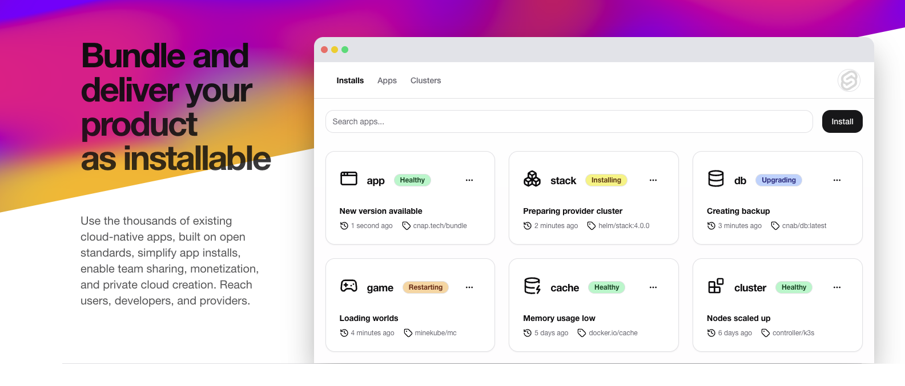

# Hey, this is CNAP 👋

We're building the future of cloud-native application platforms. Since our inception, we've been working tirelessly to create a unified ecosystem for developers, providers, and users of cloud-native apps. Our mission? To simplify the installation, management, and monetization of cloud-native applications while providing a secure and user-friendly environment for all stakeholders.

### 🚀 An interconnected cloud-native community

The cloud-native community is the 💗 heart of CNAP and fundamental to how we build and deploy software today. We're addressing the key challenges in the cloud-native space:

- **72% of companies use multiple cloud-native application platforms**, highlighting the need for flexibility but also creating management and consistency challenges.
- **65% of stakeholders report at least one direct financial benefit from cloud-native approaches**, including new revenue-generating customer experiences (26%) and improved IT staff efficiency (70%).
- However, **55% cite compliance with security and governance requirements as the biggest challenge** in creating or adopting a cloud-native application platform.

Are you part of the cloud-native revolution? Yes? Awesome! 🎸 If not, we can help you get started! Cloud-native development is driven by people just like you. Learn more about [how to get involved](https://cnap.tech/get-started).

### 🛠️ What CNAP offers

We provide a comprehensive platform that caters to all players in the cloud-native ecosystem, balancing flexibility with consistency:

- **For Developers:**
  - Monetize your apps by selling them to a wide audience
  - Focus on development while we handle the infrastructure
  - Reach more users through our marketplace and GitHub integration
  - Enjoy a flexible self-service model with access to a variety of services and infrastructures
  - Leverage integrated third-party tools for enhanced functionality

- **For Providers:**
  - Rent out your infrastructure to app users
  - Gain full transparency and control over your resources (CPU, RAM, storage)
  - Set your own prices and showcase your unique offerings
  - Easily connect and manage your infrastructure through our interface
  - Benefit from our platform's robust security standards
  - Decide which apps can be installed on your infrastructure

- **For Users:**
  - Discover a wide variety of cloud-native apps
  - Install apps with just a few clicks
  - Compare prices, locations, and security standards across different providers
  - Manage all your apps and installations from a central dashboard
  - Benefit from efficient cost management and usage optimization tools

- **For Platform and Security Teams:**
  - Implement "Golden Paths" for repeatable, secure deployment processes
  - Ensure consistency, security, and scalability across multiple platforms
  - Streamline compliance with security and governance requirements
  - Foster collaboration and knowledge sharing across teams

### 👓 How CNAP works

1. **Choose an app:** Select from our diverse marketplace
2. **Configure:** Customize app settings to your needs
3. **Pick a provider:** Compare options based on transparent information about price, location, and resources
4. **Deploy:** Launch your app with a single click, following established "Golden Paths"

### 🦦 Additional Features

- **Single Sign-On (SSO):** Access all your apps with one account
- **Centralized Billing:** Pay for app usage and infrastructure in one place
- **"Deploy Button":** Easily deploy apps directly from GitHub repositories
- **Flexible Self-Service Model:** Choose from a wide range of services while maintaining consistency
- **Golden Paths:** Ensure repeatable, secure production paths for all deployments
- **Third-Party Integration:** Seamlessly integrate your favorite tools and services
- **Advanced Cost Management:** Monitor, optimize, and get transparent billing for your cloud resource usage
- **Collaboration Hub:** Share knowledge, best practices, and improve team cooperation

### 🔮 What's Next?

See what's coming up on our [public roadmap](https://github.com/cnap/roadmap) ✨ and [let us know](https://github.com/cnap/feedback) if you have any suggestions 🙇‍♂️. We're always looking for talented, passionate people to [join our team](https://cnap.tech/careers) and help shape the future of cloud-native applications 🙌.

	
"Tell me more, I can't get enough!"

	 
	<ul>
		<li>CNAP is built using powerful 🔨 open source technologies like <a href="https://github.com/kubernetes/kubernetes">Kubernetes</a>, <a href="https://github.com/golang/go">Go</a>, and <a href="https://github.com/getporter/porter">Porter (CNAB)</a> among others.</li>
		<li>Our platform supports various application architectures and deployment patterns to meet diverse stakeholder requirements.</li>
		<li>We're committed to providing a consistent platform experience across multiple cloud environments and on-premises infrastructure.</li>
		<li>CNAP emphasizes automation, integration, and self-service capabilities to streamline the entire application lifecycle.</li>
		<li>We combine cloud-native application platforms with modern disciplines like platform engineering and DevSecOps to create a smoother experience.</li>
		<li>Our approach aims to balance flexibility and consistency by providing developers with a self-service model that is curated and offers platform teams and security managers a repeatable and consistent path to production.</li>
		<li>CNAP's architecture is designed to scale effortlessly with increasing numbers of users, apps, and providers, ensuring we can meet future market demands.</li>
		<li>We prioritize transparency for providers, allowing them to showcase their unique offerings and set their own prices, while giving users the information they need to make informed decisions.</li>
		<li>Our platform facilitates improved collaboration and knowledge sharing between developers, operations teams, and other stakeholders, recognizing that both technical aspects and user experience are crucial in the cloud-native application landscape.</li>
	</ul>

---
🤫 Psst! Want to learn more about cloud-native technologies? Check out the [CNCF landscape](https://landscape.cncf.io/).

<!--
Made with ☁️ by the CNAP team
-->
